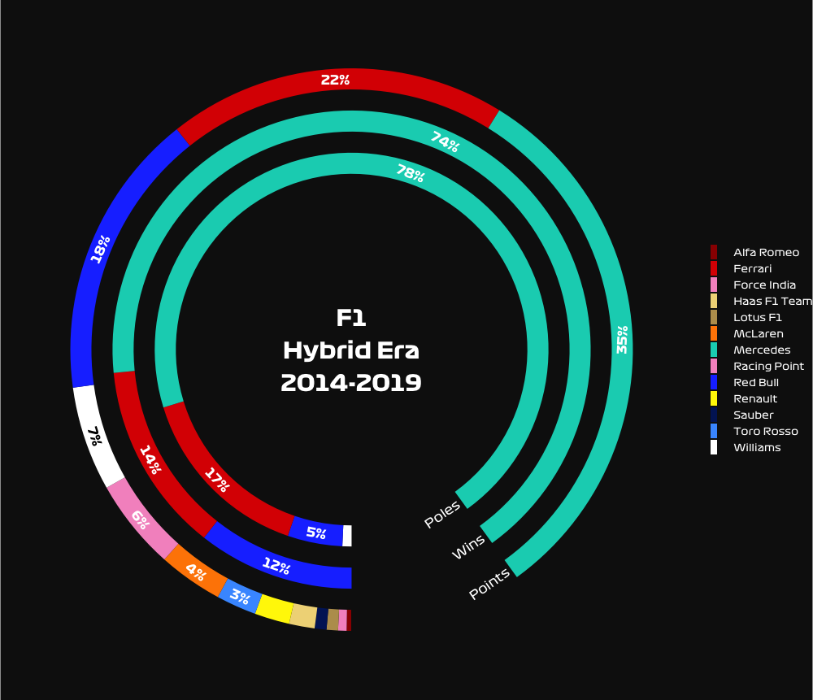
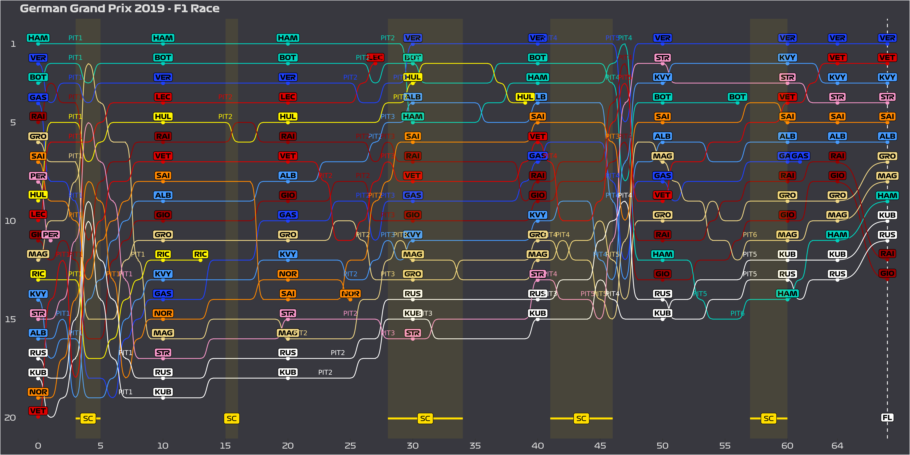
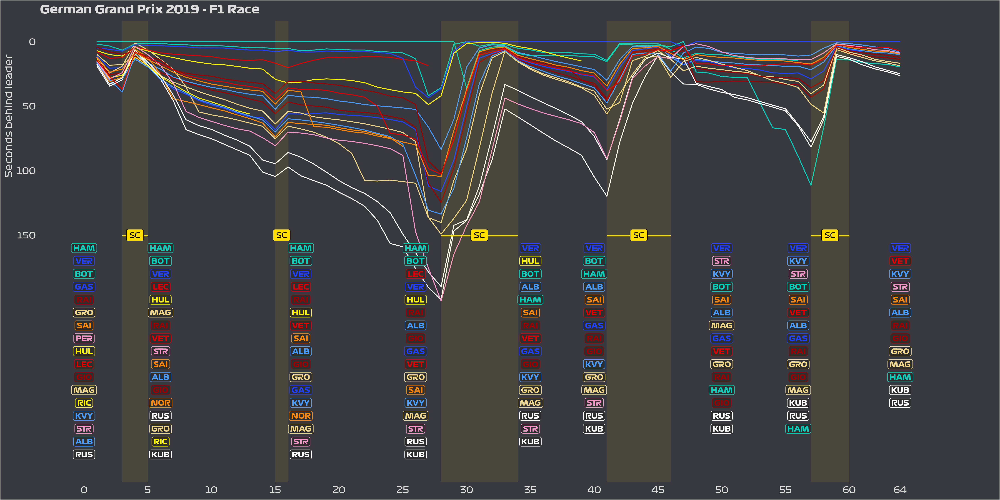

#  Formula One Data Analysis

Data from extracted using [Ergast API](http://ergast.com/mrd/).

- F1 German GP 2019 => [ergast_german2019.R](ergast_german2019.R)
- F1 French GP 2019 => [ergast_french2019.R](ergast_french2019.R)
- F1 points exploration => [ergast_points.R](ergast_points.R)
- F1 hybrid era exploration => [ergast_hybrid.R](ergast_hybrid.R)

### Example

