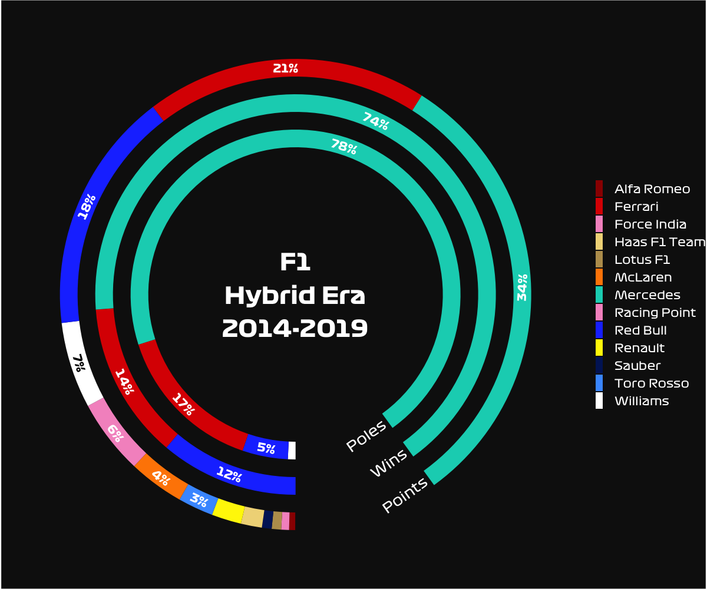

#  Formula One Data Analysis

Data from extracted using [Ergast API](http://ergast.com/mrd/).

- F1 German GP 2019 => [ergast_data.R](ergast_data.R)
- F1 French GP 2019 => [ergast_data_fr.R](ergast_data_fr.R)

### Example

